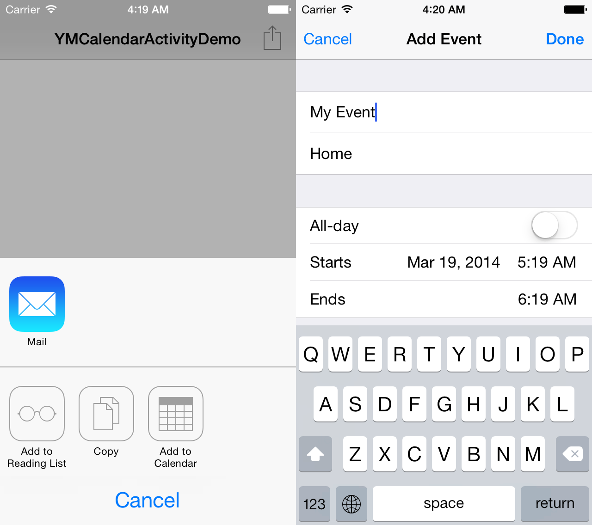

YMCalendarActivity
==================
**YMCalendarActivity** is a custom `UIActivity` that adds event to the calendar with `EKEventEditViewController`.



Requirements
============
iOS 6+ for `UIActivity` support.

Installation
============
Add EventKit.framework and EventKitUI.framework to your project.
Then add `YMCalendarActivity.h`, `YMCalendarActivity.m`, `YMCalendarActivityEvent.h` and `YMCalendarActivityEvent.m` to your project.

Usage
=====
```objective-c```
- (void)actionButtonPushed:(id)sender {
    NSString *text = @"YMCalendarActivity";
    NSURL *url = [NSURL URLWithString:@"https://github.com/litesystems/YMCalendarActivity"];
    YMCalendarActivityEvent *event = [[YMCalendarActivityEvent alloc] init];

    event.title = @"My Event";
    event.location = @"Home";
    event.notes = @"Lorem ipsum dolor sit amet, consectetur adipisicing elit, sed do eiusmod tempor incididunt ut labore et dolore magna aliqua.";
    event.URL = [NSURL URLWithString:@"https://github.com/litesystems/YMCalendarActivity"];
    event.timeZone = [NSTimeZone localTimeZone];
    event.startDate = [NSDate dateWithTimeIntervalSinceNow:60*60];
    event.endDate = [NSDate dateWithTimeInterval:60*60 sinceDate:event.startDate];

    YMCalendarActivity *activity = [[YMCalendarActivity alloc] init];

    UIActivityViewController *avc = [[UIActivityViewController alloc] initWithActivityItems:@[text, url, event]
                                                                      applicationActivities:@[activity]];

    [self presentViewController:avc animated:YES completion:nil];
}
```

